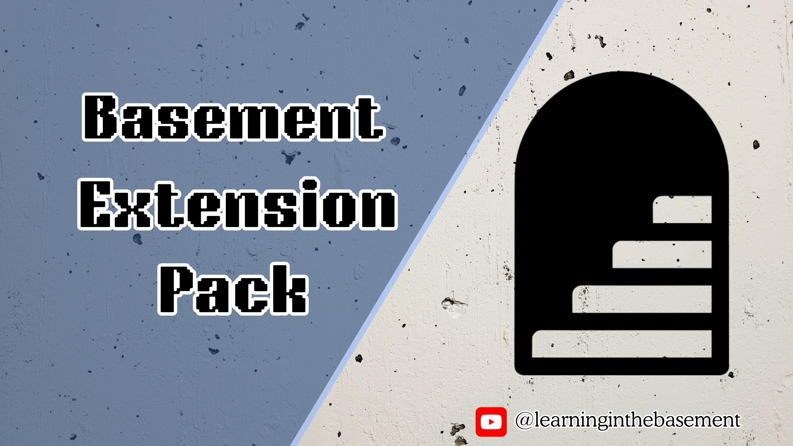

# basement-extension-pack README

[Click here to See full video of this extension ](https://www.youtube.com/@LearningInTheBasement)

# Description

This extension is an opiniated extension pack for programmers that write code in their basement.
It was created with Powershell developpement in mind, but It can be used with Any language. Just try it!

# How to Install

To install, simply search for '*Basement Extension Pack*' in VsCode extension panel.

